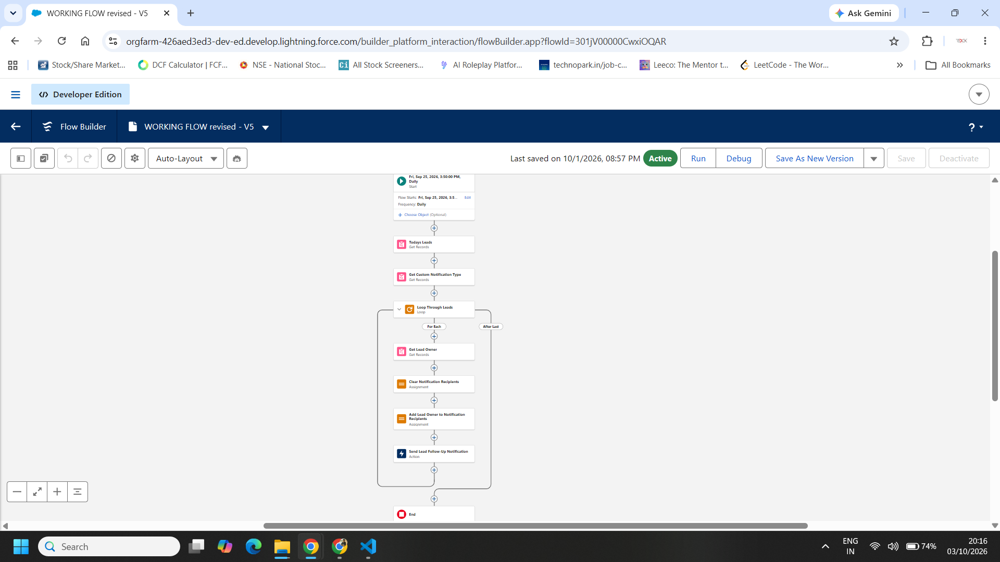
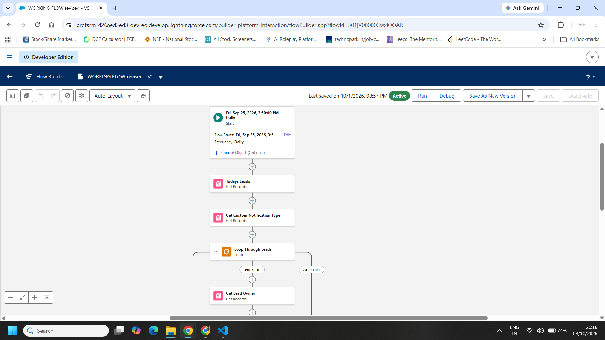
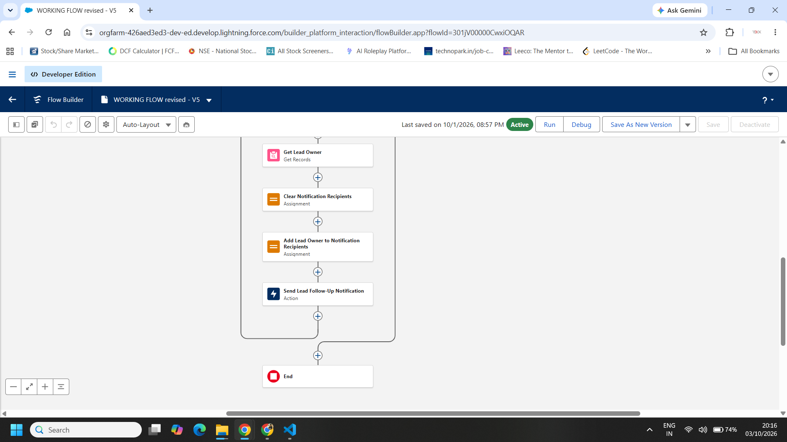
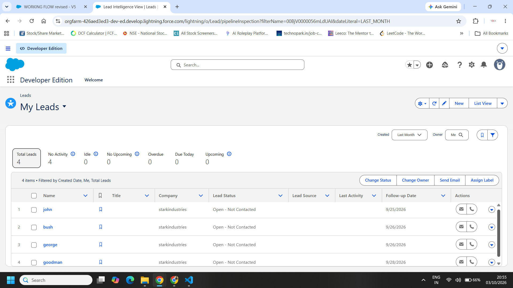
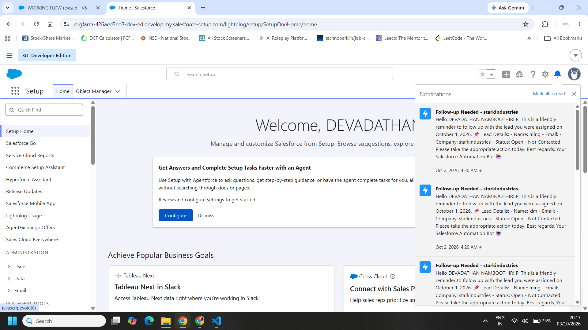

# Salesforce Lead Tracker

A Salesforce DX project that automatically reminds lead owners to follow up with their leads. Set a **Follow-up Date** on a Lead, and on that day the owner gets a bell + mobile notification with the lead's details.

## How it works

1. A custom date field **Follow-up Date** (`Follow_up__c`) is added to the Lead object.
2. A **Scheduled Flow** (`WORKING_FLOW`) runs daily and:
   - finds all Leads where `Follow_up__c` = today
   - looks up the Lead Owner
   - sends a **Custom Notification** (`Lead Follow-Up Reminder`, desktop + mobile) to the owner with the lead's name, email, company and status
3. Tapping the notification opens the Lead record.

## Metadata included

| Type | Name |
|------|------|
| Custom Field | `Lead.Follow_up__c` (Date) |
| Custom Notification Type | `Lead_Follow_Up_Reminder` |
| Flow (Scheduled, Autolaunched) | `WORKING_FLOW` |

## Tech

Salesforce Flow Builder · Custom Notifications · Salesforce DX (API v67.0)

## Setup

**Prerequisites:** [Salesforce CLI](https://developer.salesforce.com/tools/salesforcecli), VS Code with Salesforce Extension Pack, a Developer Edition org.

```bash
git clone https://github.com/Devadathan-dev/salesforce-lead-tracker.git
cd salesforce-lead-tracker

# log in to your org
sf org login web --alias myorg

# deploy
sf project deploy start --source-dir force-app --target-org myorg
```

After deploying:

1. Add **Follow-up Date** to the Lead page layout (Setup → Object Manager → Lead → Page Layouts).
2. Make sure the flow is **Active** (Setup → Flows). Adjust the schedule/run time if needed.
3. Create a Lead, set Follow-up Date to today, and wait for the scheduled run (or debug the flow from Flow Builder).

## Screenshots

### Flow overview


### Flow (start, lookups, loop)


### Flow (loop actions)


### Lead list with Follow-up Date field


### Notification received by lead owner


## Project structure

```
force-app/main/default/
├── flows/                 # WORKING_FLOW (scheduled reminder flow)
├── notificationtypes/     # Lead Follow-Up Reminder
└── objects/Lead/fields/   # Follow_up__c
manifest/package.xml       # alternative deploy manifest
config/                    # scratch org definition
```

## Author

**Devadathan Namboothiri P** — [GitHub](https://github.com/Devadathan-dev) · [LinkedIn](https://www.linkedin.com/in/dn2002)

## License

MIT — see [LICENSE](LICENSE).
